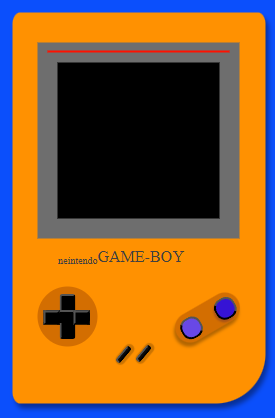

# 🎮Simulador de GAME BOY🎮

Este proyecto ha sido creado con el uso de:

La finalidad del proyecto ha sido poner en práctica las habilidades adquiridas en clase sobre HTML5. CSS,Flexbox, JavaScrip, DOM/BOM.

## Funcionalidades

La parte visual de este proyecto está enteramente creada con CSS. GAME BOY está compuesta por una pantalla, botón de encendido/apagado, botón derecha y botón izquierda.

###### En la parte central bajo la pantalla de la consola encontramos el botón on/off

Al presionar el botón izquierdo se activa la pantalla mientras suena un tono de inicio y visualiza la pantalla de homme.
Al presionar el botón de la derecha se apagará la consola.

###### En la parte izquierda bajo la pantalla de la consola encontramos los botones derecha/izquierda.

Al presionar el botón derecho avanzaras una imagen.
Al presionar el botón izquierdo retrocederás una imagen.

###### En la parte derecha bajo la pantalla de la consola encontramos dos botones que no fueron dotados de ninguna acción.

